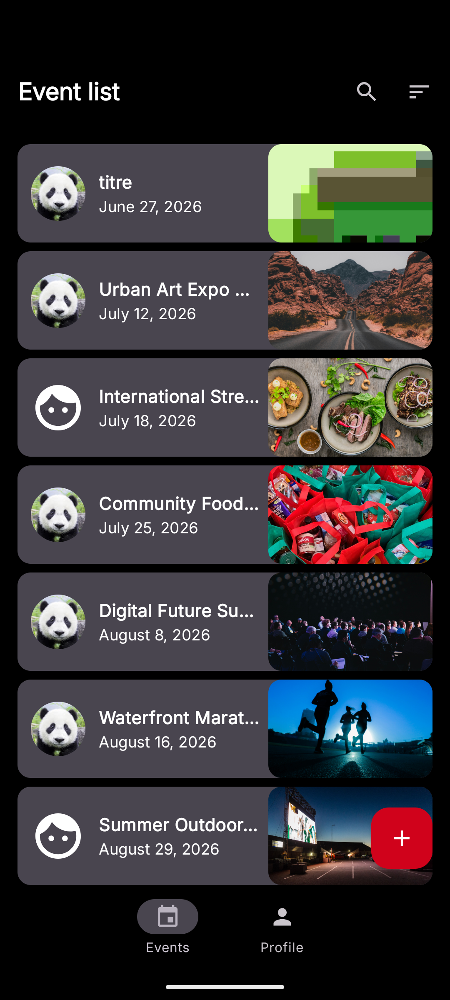
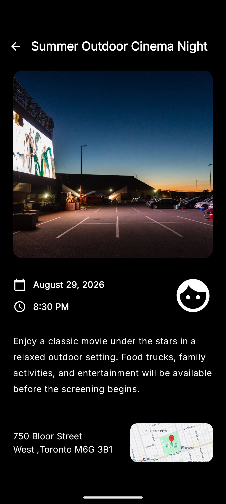
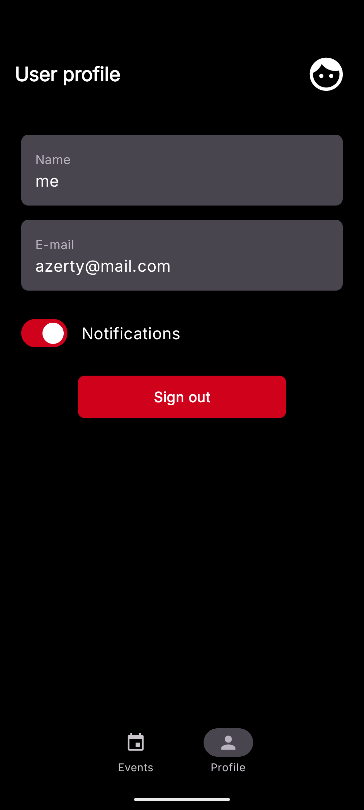

# Eventorias

Eventorias is an Android application designed for discovering and sharing events. It is built with Jetpack Compose and following clean architecture principles, it allows users to browse, search, and manage events.

## 🚀 Features

- **Event Browsing**: View a list of events with detailed information.
- **Search & Filtering**: Find events by title and sort them by date or category.
- **User Authentication**: Secure sign-in and profile management powered by Firebase Auth.
- **Real-time Data**: Event data is synchronized in real-time using Cloud Firestore.
- **Cloud Storage**: Event images and user profile pictures are hosted on Firebase Storage.
- **Modern UI**: A responsive interface built entirely with Jetpack Compose and Material 3.

## 🛠 Tech Stack

- **Language**: Kotlin
- **UI Framework**: Jetpack Compose
- **Dependency Injection**: Koin
- **Backend Services**: Firebase (Firestore, Auth, Storage, Cloud Messaging)
- **Image Loading**: Coil
- **Asynchronous Programming**: Kotlin Coroutines & Flow
- **Architecture**: MVVM (Model-View-ViewModel) with Clean Architecture layers.

## 📸 Screenshots

---
Developed as part of the Android learning path.
